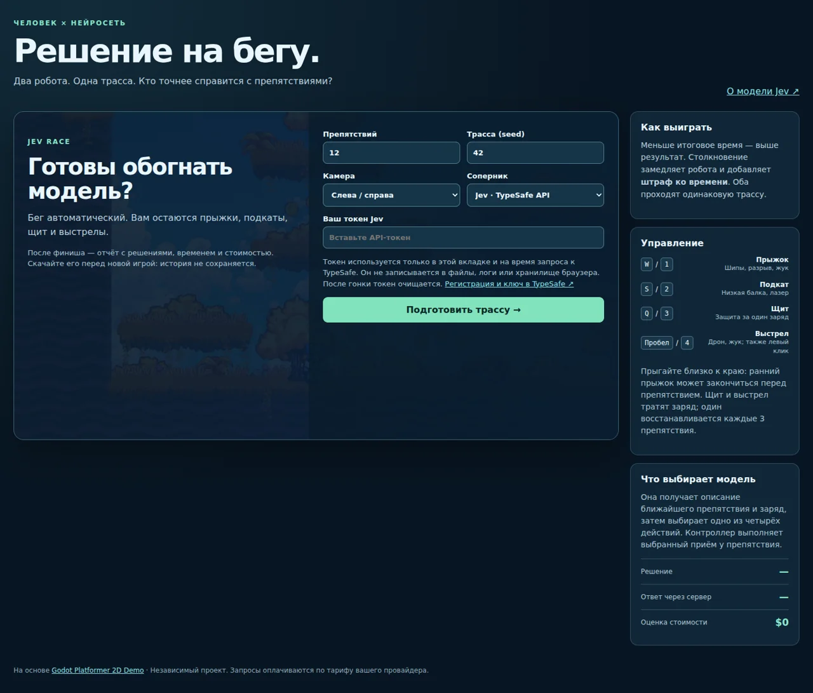

# Jev Race

**Браузерная гонка человека против модели принятия решений.** Роботы бегут сами, а вы и Jev выбираете, как пройти шипы, разрывы, балки, лазеры и врагов. После финиша видно каждое решение, штраф, задержку и оценочную стоимость запросов.

Игра построена на Godot Platformer 2D Demo. Сервер — небольшой Python/FastAPI-сервис. База данных, аккаунты игроков и внешние сервисы хранения не нужны.

Внутри: воспроизводимый генератор трасс, две камеры, заменяемые модели и слои принятия решений. Общие файлы игры сжаты: около **8,4 МиБ** при первой загрузке с Brotli. Дальше браузер использует кеш.



## Быстрый запуск в Docker

Нужен Docker с поддержкой Linux-контейнеров и Docker Compose.

```bash
docker compose up --build -d
```

Откройте **http://localhost:8080**. Выберите длину трассы и камеру, вставьте свой токен Jev и нажмите «Подготовить трассу». Когда игра загрузится, она будет ждать: **нажмите любую клавишу, если готовы**.

Получить аккаунт и API-ключ можно в [консоли TypeSafe](https://console.typesafe.ai/). Доступность регистрации и условия API определяет TypeSafe. Официальные ссылки: [сайт](https://typesafe.ai/), [начало работы с API](https://docs.typesafe.ai/introduction/quickstart).

Первая сборка скачивает Godot и Python-зависимости. Движок компилировать из исходников не требуется: сборщик берёт проверенные по SHA256 официальные бинарные файлы и только Web-шаблоны. В готовом контейнере остаются веб-экспорт и сервер. Сборочная стадия использует `linux/amd64`; на ARM Docker запускает её через эмуляцию.

Без Compose:

```bash
docker build -t jev-race:local .
docker run --rm -p 8080:8080 --read-only --tmpfs /tmp jev-race:local
```

Остановить Compose: `docker compose down`.

## Как играть

| Действие | Клавиши | Когда помогает |
|---|---|---|
| Прыжок | W или 1 | Шипы, разрыв, жук |
| Подкат | S или 2 | Низкая балка, верхний лазер |
| Щит | Q или 3 | Опасность, которую можно заблокировать |
| Выстрел | Пробел, левый клик или 4 | Дрон или жук |

На экране также есть кнопки действий. Камеры **слева/справа** и **сверху/снизу** переключаются во время гонки. Прыжок исполняется сразу: если прыгнуть слишком рано, робот приземлится перед препятствием.

Для записи геймплея без ручного управления откройте `/race?seed=42&autoplay=1`. В кадре сохраняются стороны «Вы» и «Jev», а решения за персонажа игрока принимает Jev. Для каждого препятствия выполняется отдельный запрос за каждую сторону; итоговая стоимость включает оба. В отчёте указан фактический способ управления. Локальный помощник `scripts/record_preview.py` записывает видео из браузера, читая `TYPESAFE_API_KEY` из окружения только на время записи. Нужны Playwright и установленный Chromium.

Побеждает участник с меньшим итоговым временем. Столкновение замедляет робота и по умолчанию добавляет 2 секунды. Щит и выстрел расходуют заряд. В начале их три; один возвращается после каждых трёх препятствий.

Jev получает текстовое описание ближайшей ситуации и доступный заряд. Он выбирает действие; игровой контроллер исполняет его у препятствия. Человек сам выбирает момент нажатия. Это наглядная демонстрация решений модели, **не строгий тест превосходства над человеком**. Сетевые задержки входят в наблюдаемое время ответа; ответ за 300 мс не гарантируется.

## Токен и отчёт

- Токен хранится только в памяти текущей вкладки. Поле очищается сразу после подготовки; значение удаляется из состояния приложения после финиша, отмены, новой игры и ухода со страницы.
- При запросе токен проходит через сервер к официальному API TypeSafe. Сервер не сохраняет его в сессии, файлах или логах и не берёт общий токен из окружения владельца сайта.
- Сервер не хранит матчи и не получает итоговый отчёт. Результат собирается в браузере.
- После гонки можно скачать автономный HTML или JSON. Новая гонка и обновление страницы удаляют доступный в приложении отчёт; уже скачанный вами файл остаётся у вас.
- Истории матчей, cookies, Local Storage, Session Storage и service worker нет. Кешируются только общие файлы игры.
- Если API недоступен, результат помечается «без зачёта». Ошибка связи отделена от неверного выбора действия.

Владелец публичного сервера технически имеет доступ к проходящим через него запросам. Вводите личный ключ только на доверенном сайте с HTTPS. Условия обработки данных самим TypeSafe действуют отдельно.

## Для разработчика

```bash
python3 -m venv .venv
source .venv/bin/activate
pip install -r requirements.lock.txt
python scripts/fetch_godot.py /tmp/jev-race-godot
GODOT_BIN=/tmp/jev-race-godot/godot bash scripts/build_web.sh
python -m race --host 127.0.0.1 --port 8080
```

Если Godot 4.7.2 и Web export templates уже установлены, достаточно указать свой `GODOT_BIN`. После изменений в `game/` пересоберите веб-экспорт. Изменения Python требуют перезапуска сервера; HTML/CSS/JS — обновления страницы.

```text
race/levels.py       Генератор, типы препятствий и контекст решения
race/contracts.py    Контракты модели, слоёв и планировщика
race/brains/         Jev, необязательные Laya и LLM-планировщик
race/app.py          API без постоянного состояния
race/ui/             Страница игры, метрики, отчёт и скачивание
game/race.gd         Гонка, ввод, камеры и обмен с браузером
game/track_renderer.gd  Отрисовка трассы
game/race_runner.gd  Физика робота и исполнение приёмов
examples/            Подключение моделей, слоёв и правил
```

Документация:

- [Генератор и настройка трасс](docs/levels.md)
- [Своя модель, Laya и сочетание LLM + Jev](docs/models.md)
- [Развёртывание, приватность и эксплуатация](docs/deployment.md)
- [Проверка изменений](docs/testing.md)
- [Результаты проверки версии 0.1.0](docs/validation.md)

## Лицензия и авторство

Код проекта — [MIT](LICENSE). Графика, звуки и основа физики взяты из [Godot Platformer 2D Demo](https://github.com/godotengine/godot-demo-projects/tree/master/2d/platformer), также MIT. Музыка: *Pompy*, Hubert Lamontagne. Полный список заимствований — [THIRD_PARTY_NOTICES.md](THIRD_PARTY_NOTICES.md).

Проект независимый и не является официальной игрой TypeSafe. API-ключи, веса моделей и оплачиваемые услуги провайдеров не входят в лицензию этого репозитория.
